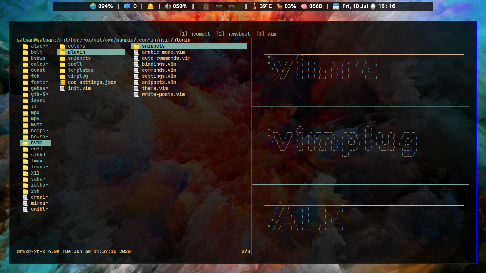
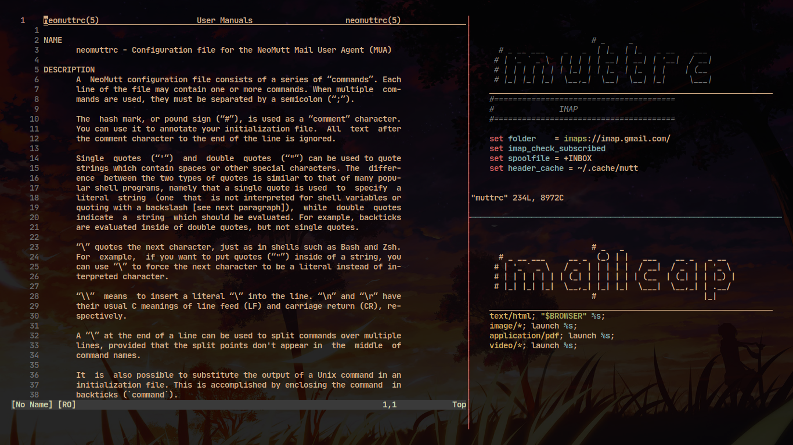

# Magpie

Dotfiles of my minimal Unix system geared for media, programming & writing.

## Line-up Highlights

| Types                | Programs                                                                                                |
| -------------------- | ------------------------------------------------------------------------------------------------------- |
| Shell                | [zsh](http://www.zsh.org/)                                                                              |
| Text Editor          | [neovim](https://github.com/neovim/neovim)                                                              |
| File Explorer        | [lf](https://github.com/gokcehan/lf)                                                                    |
| RSS Reader           | [newsboat](https://github.com/newsboat/newsboat)                                                        |
| Mail Client          | [neomutt](https://github.com/neomutt/neomutt)                                                           |
| Launcher             | [bolt](https://github.com/salman-abedin/bolt)                                                           |
| Torrent Client       | [tide](https://github.com/salman-abedin/tide)                                                           |
| URL Launcher         | [puri](https://github.com/salman-abedin/puri)                                                           |
| Command Scheduler    | [fcron](http://fcron.free.fr/)                                                                          |
| Music Player         | [mpd](https://github.com/MusicPlayerDaemon/MPD) + [ncmpcpp](https://github.com/ncmpcpp/ncmpcpp)         |
| Terminal Multiplexer | [tmux](https://github.com/tmux/tmux)                                                                    |
| Terminal Emulator    | [alacritty](https://github.com/alacritty/alacritty)                                                     |
| Window Manager       | [bspwm](https://github.com/baskerville/bspwm)                                                           |
| Status Bar           | [yabar](https://github.com/koekeishiya/yabai) + [uniblocks](https://github.com/salman-abedin/uniblocks) |
| Compositor           | [xcompmgr](https://wiki.archlinux.org/index.php/xcompmgr)                                               |
| Document Viewer      | [zathura](https://github.com/pwmt/zathura)                                                              |
| Notification Daemon  | [dunst](https://github.com/dunst-project/dunst)                                                         |
| Scripts              | [Alfred](https://github.com/salman-abedin/alfred)                                                       |
| Wallpapers           | [Eyelust](https://github.com/salman-abedin/eyelust)                                                     |

## Installation

-  [MISS: Magpie Installer Shell Script](https://github.com/salman-abedin/miss)

---

---

## Repos you might be interested in

-  [crystal](https://github.com/salman-abedin/crystal)
   : The transparent setup

-  [devour](https://github.com/salman-abedin/devour)
   : Terminal swallowing

## Contact

SalmanAbedin@disroot.org
